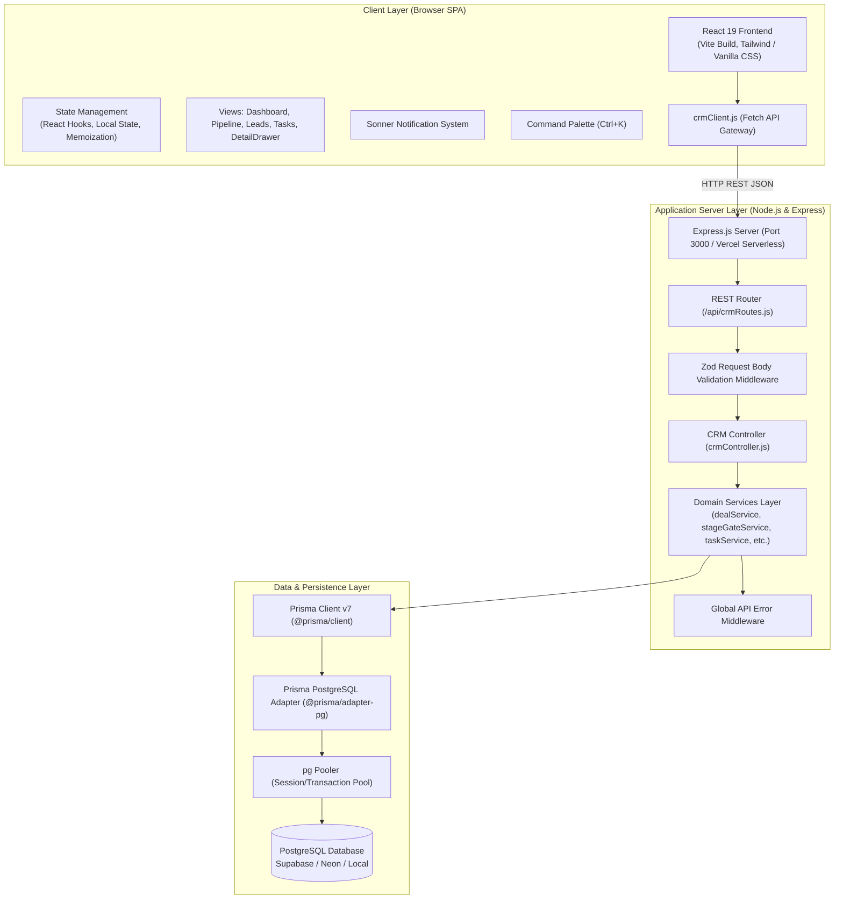

<p align="center">
  <a href="README.md">📖 Overview</a> &nbsp;|&nbsp;
  <a href="features.md">✨ Features</a> &nbsp;|&nbsp;
  <a href="flow.md">🔄 Flow</a> &nbsp;|&nbsp;
  <b>🏗️ Architecture</b> &nbsp;|&nbsp;
  <a href="db.md">🗄️ Database</a> &nbsp;|&nbsp;
  <a href="api.md">🔌 API</a> &nbsp;|&nbsp;
  <a href="setup-guide.md">🚀 Setup Guide</a>
</p>

---

# Sales CRM — System Architecture & Technical Specification

This document provides a comprehensive technical blueprint of the Sales CRM platform, covering application architecture, technology stack, directory organization, client-server communication, database design, security model, and error-handling strategies.

---

## 1. High-Level Architecture Overview

Sales CRM is built as a modern, decoupled Single Page Application (SPA) powered by a lightweight Node.js/Express REST API backend, an enterprise-grade PostgreSQL persistence layer, and Prisma ORM 7 with native pg driver adapters.



---

## 2. Technology Stack & Frameworks

| Layer | Technology | Version | Architectural Responsibility |
|:---|:---|:---|:---|
| **Frontend Framework** | React | `^19.0.1` | Component-based interactive UI, concurrent rendering, error boundaries |
| **Frontend Build Tool** | Vite | `^6.2.3` | Lightning-fast HMR dev server and optimized production ES module bundling |
| **UI Icons** | Lucide React | `^0.546.0` | Accessible, tree-shakeable SVG icon system |
| **Toast Engine** | Sonner | `^2.0.8` | Non-blocking, stacked, accessible toast notification system |
| **Animation** | Motion (Framer) | `^12.23.24` | Micro-interactions, slide-over drawer transitions, modal spring physics |
| **Backend Framework** | Express.js | `^4.21.2` | Minimalist HTTP REST API server, JSON body parsing, route handlers |
| **Validation Engine** | Zod | `^4.6.5` | Type-safe runtime schema validation for incoming HTTP request payloads |
| **ORM** | Prisma ORM | `^7.10.0` | Next-generation schema modeling, type generation, migrations, query engine |
| **Database Adapter** | `@prisma/adapter-pg` | `^7.10.0` | High-performance SQL driver adapter for Prisma 7 with PostgreSQL connection pooling |
| **PostgreSQL Driver** | `pg` (node-postgres)| `^8.23.0` | Native Node.js client for PostgreSQL |
| **Styling** | Vanilla CSS + Tailwind | `^4.1.14` | 60-30-10 surface elevation hierarchy, glassmorphism, WCAG AA contrast |
| **Testing** | Vitest | `^5.0.1` | Fast unit & integration testing for state transitions and Zod validation |
| **Bundler** | Esbuild | `^0.25.0` | Server-side bundle compilation for deployment |

---

## 3. Directory Structure & Code Organization

The repository adheres to a clean separation of concerns:

```text
crm-demo/
├── backend/                        # Backend Node.js / Express application
│   ├── constants/                  # Domain constants & configuration
│   │   └── stageConstants.js       # Allowed transitions, stage colors, hex mappings
│   ├── controllers/                # HTTP request/response orchestration
│   │   └── crmController.js        # Controller handlers delegating to domain services
│   ├── data/                       # Initial and mock datasets
│   │   └── initialData.js          # Seed records for users, stages, deals, etc.
│   ├── middleware/                 # Express middleware
│   │   └── validation.js           # Zod schema definitions & validateBody middleware
│   ├── routes/                     # API routing
│   │   └── crmRoutes.js            # Express router mapping endpoints to controllers
│   ├── services/                   # Core business logic layer
│   │   ├── activityNoteService.js  # Activities, notes, and immutable audit logging
│   │   ├── companyService.js       # Corporate account domain logic
│   │   ├── contactService.js       # Contact management and CSV bulk import
│   │   ├── dealService.js          # Deals, transitions, rebuy engine, renewal triggers
│   │   ├── leadService.js          # Lead qualification, conversion, title validation
│   │   ├── stageGateService.js     # Stage-gate checklists, approvals, task creation
│   │   ├── stageService.js         # Pipeline stage configuration
│   │   ├── systemService.js        # Health checks, state hydration, state reset
│   │   ├── taskService.js          # Tasks, agenda, manager approvals
│   │   └── userService.js          # Staff & RBAC profile management
│   ├── utils/                      # Server-side utilities
│   │   └── dateUtils.js            # Timezone-safe local date string formatters
│   ├── prisma.js                   # PrismaClient instance with PrismaPg adapter
│   └── server.js                   # Express server entry point & Vite dev middleware
│
├── frontend/                       # React 19 Frontend application
│   ├── api/                        # Client-side API gateway
│   │   └── crmClient.js            # Fetch wrapper communicating with /api endpoints
│   ├── components/                 # React UI components & view modules
│   │   ├── AddActivityModal.jsx    # Log call, meeting, or interaction
│   │   ├── CompaniesView.jsx       # Corporate accounts table & detail
│   │   ├── ContactsView.jsx        # Contact directory & management
│   │   ├── DashboardView.jsx       # Executive KPI cards & analytics
│   │   ├── DetailDrawer.jsx        # 360° slide-over Sheet (4 tabs)
│   │   ├── EmployeesView.jsx       # Staff directory & role governance
│   │   ├── ErrorBoundary.jsx       # Crash recovery & diagnostics UI
│   │   ├── GlobalSearchModal.jsx   # Inline command palette (Ctrl+K)
│   │   ├── Header.jsx              # Navigation header, user switcher, search bar
│   │   ├── ImportExportModal.jsx   # CSV bulk import/export modal
│   │   ├── LeadsView.jsx           # Lead pipeline, quick-filters, conversion
│   │   ├── ManifestStrip.jsx       # System status & quick metrics footer
│   │   ├── NotFoundView.jsx        # 404 missing view / tab fallback
│   │   ├── PipelineView.jsx        # Drag-and-drop Kanban & table view
│   │   ├── ReportsView.jsx         # Pipeline funnels, loss analysis, velocity
│   │   ├── SettingsView.jsx        # White-label branding & stage customization
│   │   ├── Sidebar.jsx             # Left primary navigation bar
│   │   ├── StageGateCheckModal.jsx # Yes/No qualification checklist modal
│   │   └── TasksView.jsx           # Personal tasks & Manager approval agenda
│   ├── utils/                      # Client-side helpers
│   │   └── crmHelpers.js           # Currency formatting, date calculations, badges
│   ├── App.jsx                     # Root application container & tab router
│   ├── index.css                   # Global styles & design system tokens
│   └── main.jsx                    # React 19 DOM bootstrap
│
├── prisma/                         # Database schema & migrations
│   ├── schema.prisma               # 12 Prisma data models & datasource config
│   └── seed.js                     # Database seeding script for demo data
│
├── tests/                          # Automated test suites (Vitest)
│   ├── stageTransition.test.js     # Stage transition matrix & color normalization
│   └── validation.test.js          # Zod schema validation edge cases
│
├── .env.example                    # Environment variable template
├── package.json                    # Project dependencies & npm scripts
├── prisma7.config.ts               # Prisma 7 CLI configuration
├── vercel.json                     # Serverless deployment configuration
└── vite.config.ts                  # Vite build configuration
```

---

## 4. Client-Side Architecture & State Model

### 4.1 Single Page Navigation Without Full Page Refreshes
- Navigation is handled cleanly via active state switching (`activeTab`) without incurring multi-page reload latency.
- Supported views: `dashboard`, `leads`, `pipeline`, `contacts`, `companies`, `tasks`, `employees`, `reports`, `settings`.
- Safe URL/tab routing fallbacks: navigating to an invalid tab renders `NotFoundView` with an instant recovery link to the Dashboard.

### 4.2 State Hydration & Optimistic Synchronization
- **Central State Hydration (`/api/state`)**: Upon initial mount, `App.jsx` issues a single call to `fetchCRMState()` to load users, stages, branding, deals, leads, companies, contacts, tasks, notes, activities, and audit logs.
- **Stage Color Normalization**: To preserve theme consistency across customized palettes, stage colors pass through `normalizeStageColor()` on hydration.
- **Context-Preserving Detail Drawer (`DetailDrawer.jsx`)**:
  - Operates as a sliding Sheet on top of Kanban or table views.
  - Keeps user scroll position, active filters, and search queries intact while inspecting deep record details.

### 4.3 Notification System Architecture
- Replaced disruptive browser alerts with Emil Kowalski's `Sonner` toast engine.
- Mounted at application root with `<Toaster position="bottom-right" richColors />`.
- Asynchronous API actions trigger contextual toasts indicating success, pending review, validation failure, or network timeouts.

---

## 5. Backend Architecture & API Design

### 5.1 Layered Architecture Pattern
The backend enforces a clean 3-layer architecture:
1. **Routing & Validation Layer (`crmRoutes.js` + `validation.js`)**:
   - Maps incoming HTTP paths to controller methods.
   - Enforces strict runtime data contract validation using Zod before controller execution.
2. **Controller Layer (`crmController.js`)**:
   - Extracts route parameters, query strings, and validated body payloads.
   - Orchestrates HTTP status codes (`200 OK`, `201 Created`, `400 Bad Request`, `404 Not Found`, `500 Internal Error`).
3. **Domain Services Layer (`services/*.js`)**:
   - Encapsulates pure business logic: stage-gate criteria validation, task creation, rebuy calculations, and permanent audit logging.
   - Interacts with PostgreSQL exclusively through `prisma.js`.

### 5.2 Zod Validation Architecture
Every mutating endpoint passes through the `validateBody(schema)` middleware:

```javascript
// Example: Deal transition schema validation
export const dealTransitionSchema = z.object({
  targetStageId: z.string().min(1, 'Target stage is required'),
  answers: z.record(z.any()).optional(),
  overrideReason: z.string().optional(),
  demotionReason: z.string().optional(),
  notes: z.string().optional(),
  user: z.object({
    id: z.string(),
    name: z.string(),
    role: z.enum(['Admin', 'Manager', 'Sales Rep']),
  }).optional(),
});
```

- Invalid payloads return immediate `400 Bad Request` with structured field-level error messages, protecting database integrity.

---

## 6. Database & ORM Architecture (Prisma 7 + PostgreSQL)

### 6.1 Prisma 7 Driver Adapter Pattern
Prisma 7 introduces driver adapters, separating query planning from direct TCP connection management. Sales CRM uses `@prisma/adapter-pg`:

```javascript
// backend/prisma.js
import 'dotenv/config';
import { PrismaClient } from '@prisma/client';
import { PrismaPg } from '@prisma/adapter-pg';

const connectionString = process.env.DATABASE_URL || process.env.DIRECT_URL;
const adapter = new PrismaPg({ connectionString });

export const prisma = new PrismaClient({ adapter });
```

### 6.2 Connection Pooling with Supabase / Neon
- **Transaction/Session Pooling**: Uses `DATABASE_URL` with transaction mode (e.g., port `6543` with PgBouncer) for high-concurrency API requests.
- **Direct Connection**: Uses `DIRECT_URL` (port `5432`) for schema migrations (`prisma db push`) and data seeding (`prisma/seed.js`).

### 6.3 Flexible JSON Payloads
To balance strict relational schema design with dynamic business requirements, key entities utilize PostgreSQL `JSONB` columns:
- `deal.valueHistory`: Tracks historical adjustments to deal value over time.
- `deal.pendingGateCheck`: Stores submitted checklist answers awaiting manager review.
- `deal.partialGateState`: Saves partial checklist answers as a rep works through qualification.
- `task.answers`: Captures criteria checklist responses submitted for manager verification.
- `auditLog.metadata`: Stores contextual snapshots of entities before and after mutations.

---

## 7. Security & Governance Architecture

### 7.1 Role-Based Access Control (RBAC) Enforcement
Sales CRM defines three operational personas:
1. **Admin**:
   - Direct Kanban drag-and-drop override privileges (requires mandatory audit reason).
   - Authority to approve or reject pending stage gates.
   - Access to company settings, stage matrix, branding, and system state resets.
2. **Manager**:
   - Access to team agenda, pending stage-gate review tasks, and approval actions.
   - Can inspect all team deals, leads, and performance reports.
3. **Sales Rep**:
   - Operates within standard qualification gates.
   - Advancing stages triggers approval tasks rather than direct transitions.
   - Access limited to assigned leads, deals, and personal tasks.

### 7.2 Immutable Audit Trail Architecture
- Audit events are written to the `AuditLog` table on every critical lifecycle transition.
- The `AuditLog` model contains **no update or delete endpoints** in the API router, ensuring immutability.
- Every audit record captures:
  - `actorId` and `actorName`: The authenticated user responsible for the action.
  - `action`: Standardized event code (e.g., `STAGE_OVERRIDE`, `STAGE_APPROVED`, `STAGE_DEMOTED`, `REBUY_CREATED`).
  - `entityType` and `entityId`: The target record modified.
  - `fromStage` and `toStage`: Stage trajectory.
  - `reason`: The qualitative explanation provided by the user.

---

## 8. Resilience, Error Boundaries & Health Checks

### 8.1 Dual-Tier Dev/Prod Server Serving
In development, `backend/server.js` boots Vite's dev server in middleware mode:
```javascript
if (process.env.NODE_ENV !== "production") {
  const { createServer: createViteServer } = await import("vite");
  const vite = await createViteServer({ server: { middlewareMode: true }, appType: "spa" });
  app.use(vite.middlewares);
} else {
  const distPath = path.join(process.cwd(), 'dist');
  app.use(express.static(distPath));
  app.get('*', (_req, res) => res.sendFile(path.join(distPath, 'index.html')));
}
```
This enables full-stack operation on a single port (`3000`) without CORS configuration issues.

### 8.2 Frontend Crash Resilience (`ErrorBoundary.jsx`)
- Wraps the entire view tree.
- Traps unhandled runtime rendering errors.
- Displays component stack traces and diagnostics.
- Provides a direct recovery action: **"Reset Demo State"**, triggering `/api/state/reset` to restore a working database state if corrupt test data was introduced.

### 8.3 Health Endpoint (`GET /api/health`)
- Returns server uptime, memory usage, environment mode, and database connectivity status for load balancers and container orchestrators.
