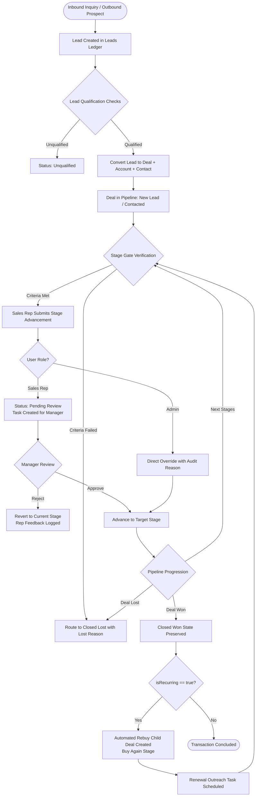
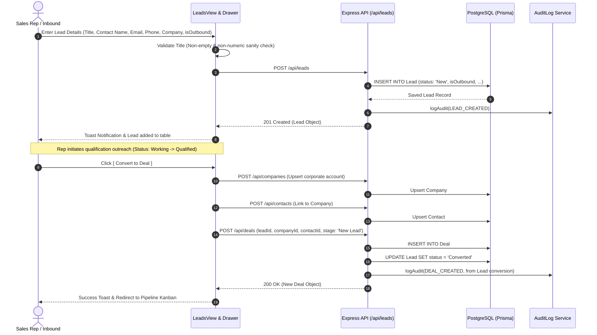
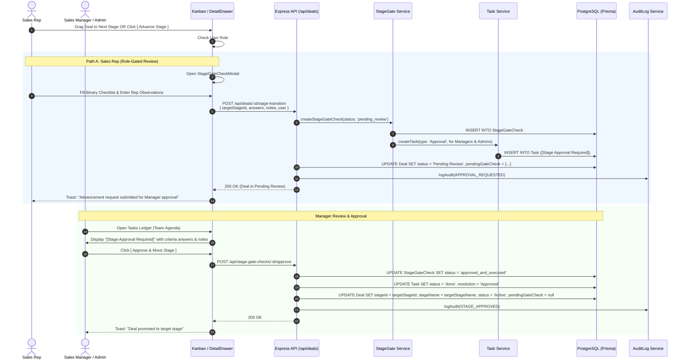
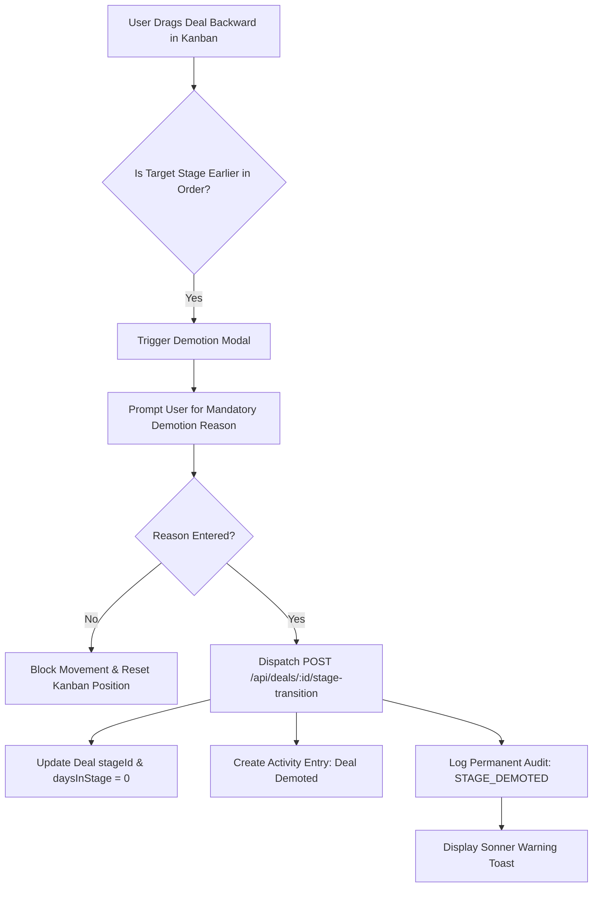
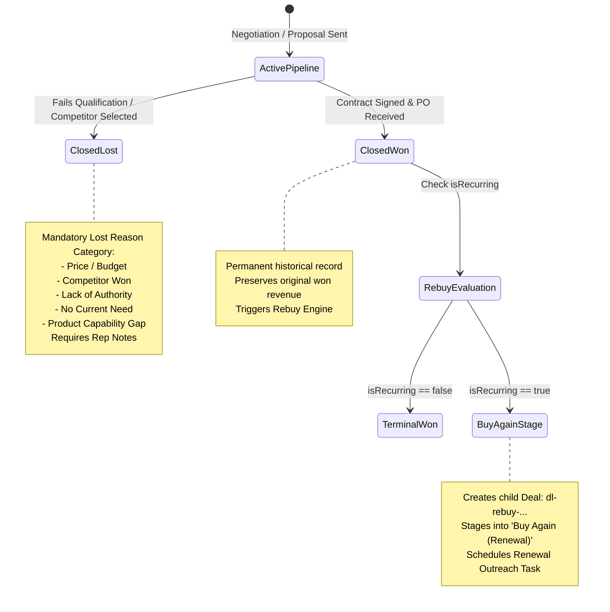
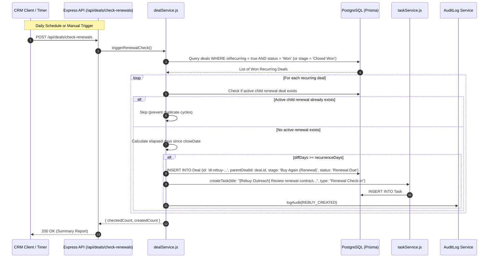
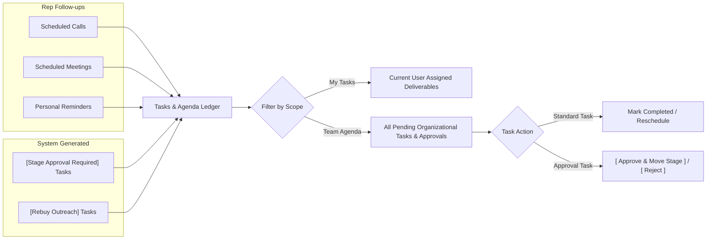
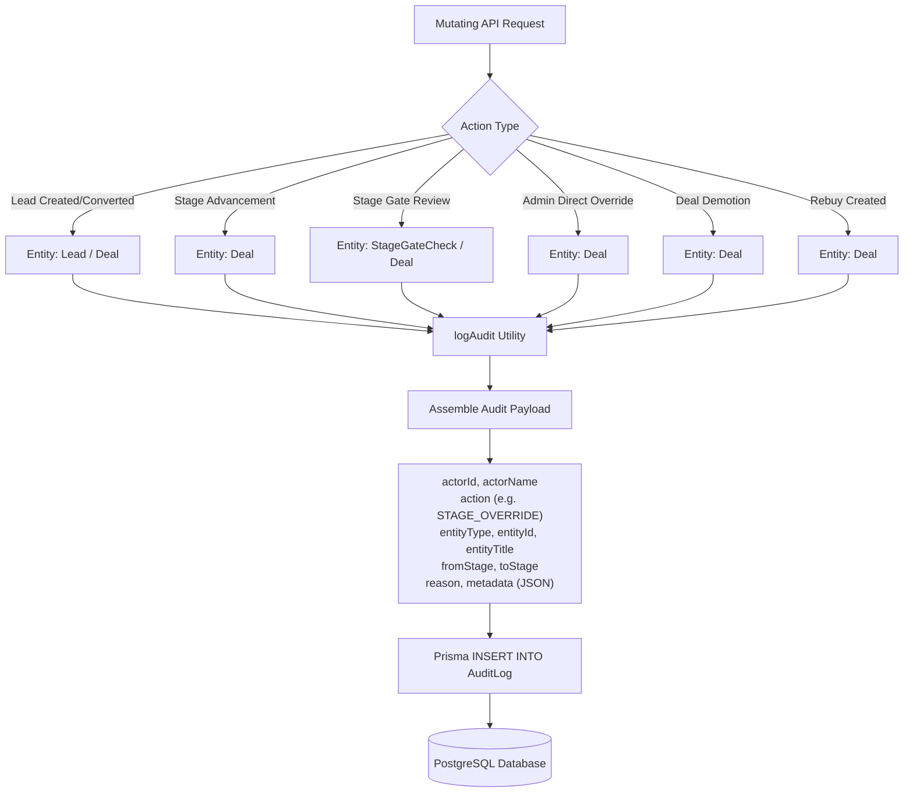
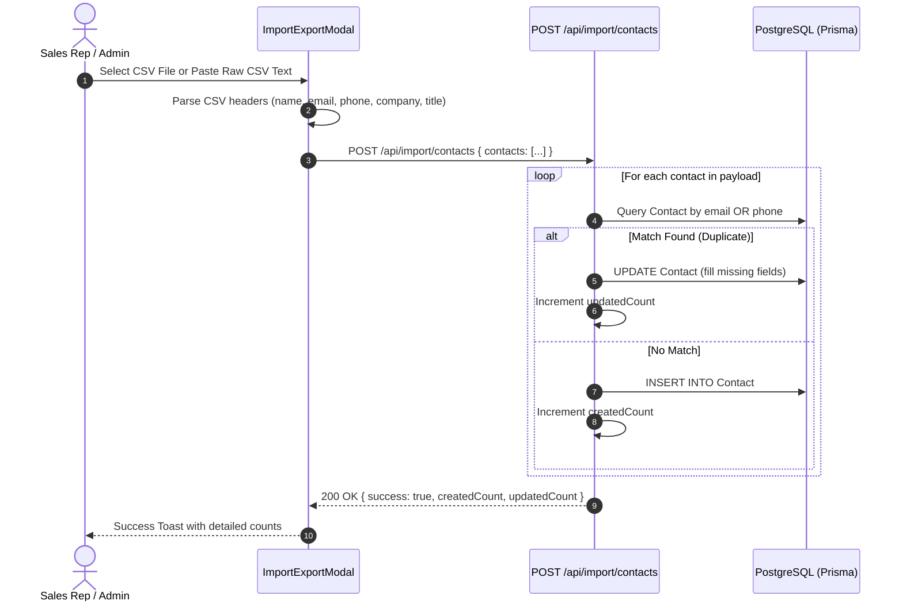

<p align="center">
  <a href="README.md">📖 Overview</a> &nbsp;|&nbsp;
  <a href="features.md">✨ Features</a> &nbsp;|&nbsp;
  <b>🔄 Flow</b> &nbsp;|&nbsp;
  <a href="architecture.md">🏗️ Architecture</a> &nbsp;|&nbsp;
  <a href="db.md">🗄️ Database</a> &nbsp;|&nbsp;
  <a href="api.md">🔌 API</a> &nbsp;|&nbsp;
  <a href="setup-guide.md">🚀 Setup Guide</a>
</p>

---

# Sales CRM — Complete System & Process Flows

This document details the end-to-end workflows, lifecycles, and operational flows governing the Sales CRM platform. Every flow is illustrated using step-by-step logic, actors involved, database mutations, and Mermaid sequence/state diagrams.

---

## 1. High-Level B2B Customer Journey

The complete B2B sales lifecycle moves continuously from initial lead capture through conversion, stage-gated progression, manager approval, terminal closing, and automated repeat purchase cycles:



---

## 2. Lead Qualification & Conversion Flow

Leads represent early-stage inquiries and cold outbound contacts that must be qualified before becoming active pipeline opportunities.



### Conversion Logic & Invariants:
1. **Title Validation**: Rejects purely numeric inputs (e.g. `982341`) or single-character strings.
2. **Atomic Entity Creation**:
   - `Company`: Creates a new Account if it doesn't already exist.
   - `Contact`: Creates a new Contact attached to the Account.
   - `Deal`: Generates a sales opportunity with initial stage `stg-1` (`New Lead`) or `stg-2` (`Contacted`).
3. **Lead Status Immobility**: The Lead record is marked `Converted` and permanently linked to the Deal via `deal.leadId`. It cannot be re-converted.

---

## 3. Deal Stage-Gate Progression & Approval Flow

The core governance engine of the CRM prevents unauthorized or unqualified deals from jumping stages.



### Alternative Path: Rejection Flow
If the Manager determines the criteria were not met or notes are insufficient:
1. Manager clicks **`[ Reject ]`** on the task or drawer.
2. `POST /api/stage-gate-checks/:id/reject` is invoked with feedback notes.
3. System updates:
   - `StageGateCheck.status = 'rejected'`.
   - `Task.status = 'done'`, `resolution = 'Rejected'`.
   - `Deal.status = 'Active'` (retaining the existing stage; `pendingGateCheck` cleared).
4. Permanent audit log `APPROVAL_REJECTED` is created with the manager's rejection reason.
5. Sales Rep receives an activity note and notification of the rejection.

### Alternative Path: Admin Direct Override
1. An **Admin** drags a deal card on the Kanban board or selects a target stage.
2. UI detects `user.role === 'Admin'` and displays the **Admin Override Confirmation Modal**.
3. Admin inputs a mandatory **Audit Override Reason** (e.g. *"CEO executive waiver for strategic partner"*).
4. `POST /api/deals/:id/stage-transition` is dispatched with `overrideReason`.
5. Backend advances the stage immediately without creating a pending approval task.
6. A permanent audit log `STAGE_OVERRIDE` is logged with the admin's explanation.

---

## 4. Backward Stage Demotion Flow

When an active opportunity encounters unexpected friction (e.g. technical spec changed, client champion left), moving the deal backward is strictly governed.



### Enforced Rules:
- **Demotion Reason Mandatory**: The API rejects any backward transition if `demotionReason` or `reason` is blank or whitespace.
- **Stage Aging Reset**: Moving backward resets `daysInStage` to `0` to track velocity in the reassigned stage accurately.
- **Audit Trace**: The audit ledger logs `fromStage`, `toStage`, actor ID, timestamp, and the demotion reason.

---

## 5. Terminal Stages: Closed Won vs. Closed Lost Flow

Pipeline stages terminate in one of two states: **Closed Won** (successful contract) or **Closed Lost** (deal dropped or disqualified).



### Closed Lost Protocol:
1. **Trigger**: Invoked when an agent fails gate criteria or clicks `[ Mark as Lost ]`.
2. **Payload Enforcement**:
   - `lostReason`: Selected from standard categories (`Price / Budget`, `Competitor Won`, `Timing`, `Authority`, `Product Gap`).
   - `lostReasonNote`: Explanatory qualitative text.
3. **Database Mutations**:
   - `Deal.status = 'Lost'`.
   - `Deal.stageId = 'stg-8'`, `Deal.stageName = 'Closed Lost'`.
   - `Deal.actualCloseDate = today`.
   - `Deal.lostReason = lostReason`, `Deal.lostReasonNote = note`.
4. **Terminal Invariant**: A Closed Lost deal cannot transition forward. Reopening requires creating a new deal.

---

## 6. Automated Rebuy & Renewal Generation Engine

For recurring revenue models, winning a deal initiates the next sales cycle automatically.



### Rebuy Invariants:
1. **Non-Destructive**: The parent won deal remains untouched; its win date and contract value are preserved in financial reports.
2. **Lineage Tracking**: Child renewal opportunities contain `parentDealId` pointing back to the original contract.
3. **Duplicate Prevention**: If an active child opportunity is already in flight, the renewal engine skips re-creation.

---

## 7. Manager Task & Agenda Flow

The Tasks module acts as both a personal follow-up manager and an executive governance ledger.



---

## 8. Permanent Audit Logging Flow

To maintain SOC2, ISO, and enterprise compliance, every critical state mutation is logged immutably.



### Audit Invariants:
- **No Deletion API**: Audit log entries have no corresponding DELETE endpoint; logs are append-only.
- **Actor Identification**: Captures the exact authenticated user ID and name responsible for the action.
- **Reason Preservation**: Any override or demotion stores the verbatim explanation entered by the user.

---

## 9. Contact Bulk Import & Deduplication Flow

When importing contacts from spreadsheets or external databases:



---

## 10. Application Error & Recovery Flow

The CRM features multi-tiered error boundaries to guarantee that an unexpected crash in one component does not break the entire application.

```mermaid
flowchart TD
    A[Runtime Exception in React Component] --> B{Caught by ErrorBoundary?}
    B -- Yes --> C[Render ErrorBoundary Fallback Screen]
    C --> D[Display Component Stack & Error Diagnostics]
    C --> E[Provide Options: 'Reload Page' OR 'Reset Demo State']
    
    E -- Reset Demo State --> F[POST /api/state/reset]
    F --> G[Prisma re-seeds database from initialData.js]
    G --> H[Reload Application to Pristine State]

    B -- No (API Level Error) --> I[Global Express Error Middleware]
    I --> J[Catch err and format JSON response]
    J --> K[Return HTTP 4xx/5xx with { error, statusCode }]
    K --> L[Frontend Sonner catches and displays error toast]
```
